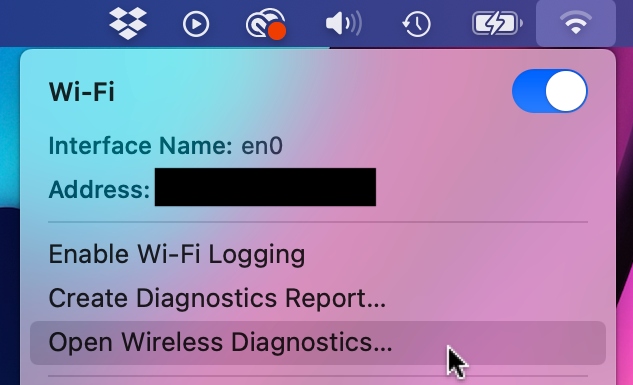
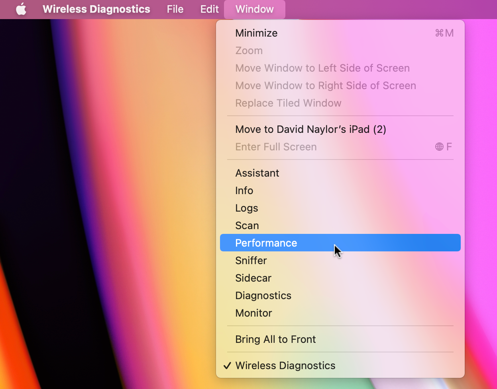
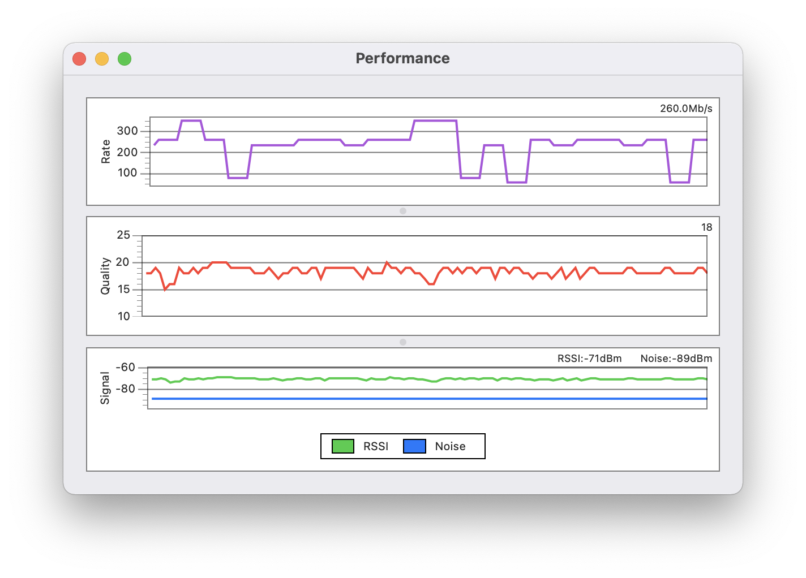

# wdmon

Tools for working with Apple Wireless Diagnostics .wdmon files.

To summarize a collection of .wdmon traces:
```bash
./wdmon.py room1.wdmon room2.wdmon
========== room1.wdmon ==========
SNR:
  min/p25/med/p75/max:	17/20.0/21.0/22.0/24
                 mean:	21.25
Tx Rate:
  min/p25/med/p75/max:	26.0/28.0/39.0/43.0/52.0
                 mean:	38.79
========== room2.wdmon ==========
SNR:
  min/p25/med/p75/max:	15/18.0/18.0/19.0/20
                 mean:	18.33
Tx Rate:
  min/p25/med/p75/max:	57.0/234.0/260.0/260.0/351.0
                 mean:	235.80
```

Use the `--csv` flag for CSV output (e.g., to paste into a spreadsheet app for plotting):
```bash
./wdmon.py --csv room1.wdmon room2.wdmon
file,mean-snr,min-snr,p25-snr,median-snr,p75-snr,max-snr,mean-rate,min-rate,p25-rate,median-rate,p75-rate,max-rate
room1.wdmon,21.246031746031747,17,20.0,21.0,22.0,24,38.79365079365079,26.0,28.0,39.0,43.0,52.0
room2.wdmon,18.333333333333332,15,18.0,18.0,19.0,20,235.7984496124031,57.0,234.0,260.0,260.0,351.0
```


## Capturing a .wdmon Performance Trace

These steps describe how to create a .wdmon WiFi performance trace on macOS.

1. Option-click the Wi-Fi menu and choose "Open Wireless Diagnostics...".

   

2. Choose "Performance" from the "Window" menu:

   

3. Leave the performance tool open to collect data. The tool will create a timestamped .wdmon file on your Desktop.
   
   
